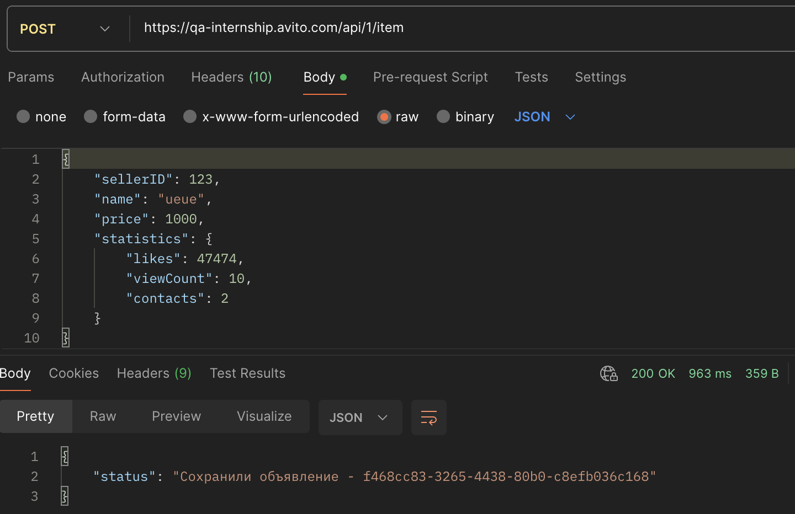

# BUGS

### BUG-01: `POST /api/1/item` возвращает ответ не по контракту Postman-коллекции

- Краткое описание: после успешного создания объявления ручка возвращает только поле `status` со строкой вида `Сохранили объявление - <uuid>`, а не объект созданного объявления.
- Шаги воспроизведения:
  1. Отправить `POST https://qa-internship.avito.com/api/1/item` с валидным JSON.
  2. Получить ответ со статусом `200 OK`.
  3. Сравнить фактическое тело ответа с примером из Postman-коллекции.
- Фактический результат: тело ответа имеет вид `{"status":"Сохранили объявление - <uuid>"}`.
- Ожидаемый результат: тело ответа содержит объект объявления с полями `id`, `sellerId`, `name`, `price`, `statistics`, `createdAt`, как указано в коллекции.
- Серьезность: Minor

